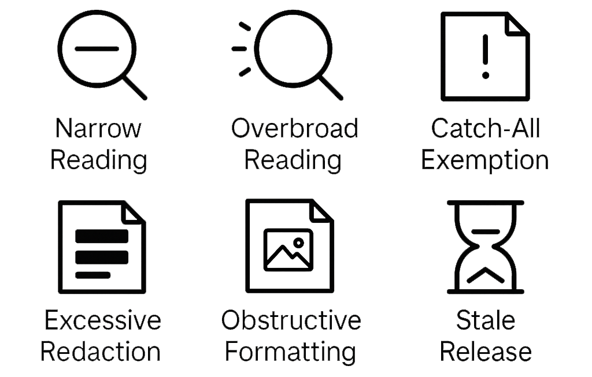

# Shadows of Transparency

This repository contains the code and analysis for the paper "Shadows of Transparency: Signaling Transparency-Impeding Behavior Using Public Data" (in press). Furthermore it contains the interview protocol and the list of Ministry abbreviations used.

The work builds on the Woogle dataset and its accompanying notebook [1], analyzing patterns in Dutch Freedom of Information Act (FOIA/Woo) documents. The dataset is available through DANS [2].

## Overview

This project implements six transparency anti-patterns to systematically assess government transparency practices:

1. **Narrow Reading** - Unusually small dossier sizes
2. **Overbroad Reading** - Unusually big dossier sizes
2. **Obstructive Formatting** - Document accessibility
3. **Excessive Redaction** - Redaction rates across documents
4. **Catch-All Exemptions** - Usage of FOIA exemption grounds
5. **Stale Release** - Response times



## Dataset

The analysis uses three main dataframes from the Woogle dataset:

- **Bodytext dataframe**: Page-level text content and metadata
- **Document dataframe**: Document-level information
- **Dossier dataframe**: Dossier-level metadata including request/decision dates

The dataset focuses on passively released documents (category '2i') from Dutch government ministries.

## Getting Started

### Prerequisites

- Python 3.8 or higher
- Jupyter Notebook or JupyterLab
- Minimum 8GB RAM (dataset processing can be memory-intensive)

### Installation

1. **Clone the repository**
   ```bash
   git clone https://github.com/joszuijderwijk/shadows-of-transparency.git
   cd shadows-of-transparency
   ```

2. **Create a virtual environment** (recommended)
   ```bash
   python -m venv venv
   # On Windows:
   venv\Scripts\activate
   # On macOS/Linux:
   source venv/bin/activate
   ```

3. **Install required packages**
   ```bash
   pip install -r requirements.txt
   ```

### Data Setup

1. **Download the Woogle dataset** from DANS:
   - Visit: https://doi.org/10.17026/DANS-ZAU-E3RK
   - Download the following files:
     - `woo_bodytext_2i.csv.gz`
     - `woo_documents.csv.gz`
     - `woo_dossiers.csv.gz`

2. **Create a data directory** and place the downloaded files.

## References

[1] van Heusden, R., Larooij, M., Kamps, J. et al. A collection of FAIR Dutch Freedom of Information Act documents. *Sci Data* 12, 795 (2025). https://doi.org/10.1038/s41597-025-05052-2

[2] M. Marx, 2023, "A collection of FAIR Dutch Freedom of Information Act documents", https://doi.org/10.17026/DANS-ZAU-E3RK, DANS Data Station Social Sciences and Humanities, V4


## Citation

```
Zuijderwijk, J., Beerepoot, I., Martens, T., Knies, E., Van der Lippe, T., & Reijers, H. A. (in press). Shadows of Transparency: Signaling Transparency-Impeding Behavior Using Public Data. EGOV26. Springer.
```

## Contact

Jos Zuijderwijk - `a.j.h.zuijderwijk [at] uu [dot] nl`